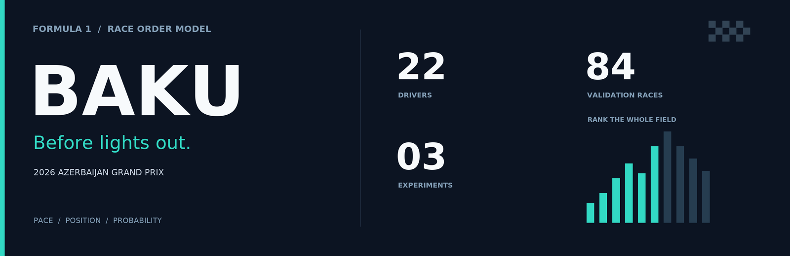
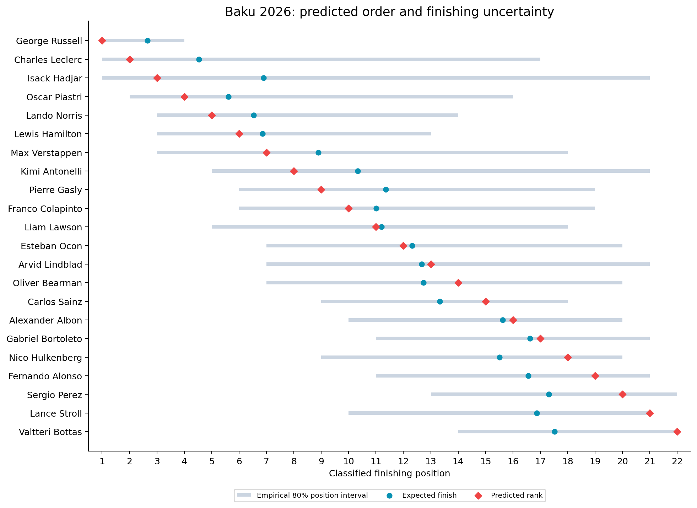

<p align="center">
  
</p>

<p align="center">
  <a href="baku_2026.ipynb"><b>Open the executed notebook</b></a>
</p>

## The idea

Predict the 2026 Azerbaijan Grand Prix finishing order using practice, qualifying and
recent driver and constructor form. Everything runs in one notebook: FastF1 extraction,
workbook and weather loading, exploration, features, model comparison and the final forecast.

**22 drivers · 166 training races · 84 validation races**

The forecast is frozen at **25 September 2026, 14:43 UTC**. The starting grid is provisional.

## The prediction



Russell, Leclerc and Hadjar lead the predicted order. Antonelli moves from P16 to P8;
Norris stays P5. The intervals are deliberately broad.

## How well does it work?

Average finishing-position error; lower is better.

| Model | 2023–2024 selection | 2025 | 2026 before Baku |
|---|---:|---:|---:|
| **Core ranker — selected** | **3.096** | 3.278 | 3.481 |
| Core + FP1 | 3.105 | 3.253 | 3.481 |
| Core + FP2 | 3.100 | 3.266 | 3.448 |
| Core + FP3 | 3.107 | 3.282 | 3.487 |
| Core + FP1, FP2 and FP3 | 3.101 | 3.257 | 3.422 |
| Starting grid | 3.306 | 3.344 | 3.403 |

Every validation race uses earlier training races only. The core ranker narrowly wins
selection on 2023–2024, so the Baku forecast stays unchanged. Combined practice improves
the later point estimates, but its paired 95% intervals versus the core model include
zero in every period. These retrospective results do not establish a reliable gain.
The selected model still trails the grid baseline in 2026.

## Experiments I tried

The notebook now compares FP1, FP2 and FP3 individually and together, using the same
ranker settings and chronological races. Each session contributes fastest-lap gap,
team-average gap and recorded lap count. Paired race-block intervals show how uncertain
the improvement over the core model is.

The earlier experiments below used the previous FP2 pipeline and have not been rerun
after the filtering corrections.

| Experiment | Result |
|---|---|
| Expected qualifying versus the actual grid | Flagged displaced drivers, but did not reliably improve race predictions. |
| More weight on recent races | Neither a 20-race half-life nor a 60-race window earned a change. |
| Twice the weight for the same circuit | Small earlier gains did not hold up in 2026. |

None justified promoting an experimental variant. These were retrospective comparisons
using already examined seasons; the qualifying experiment used a smaller matched set
of races. The current notebook reruns model selection with all three practice sessions.

## Run it

The notebook already contains its tables and plots. To rerun locally, install
`requirements.txt`, open `baku_2026.ipynb` in Jupyter or VS Code, and run all cells.

In Colab, upload the notebook, then the workbook, grid CSV and weather JSON when prompted.
If setup installs packages, restart the kernel once and run all cells again. The first
FastF1 download can take a while. If a download limit interrupts extraction, wait for
the limit to reset and rerun; completed downloads are reused from the temporary folder.

```text
baku_2026.ipynb              Extraction through prediction
requirements.txt            Python dependencies
data/weekend.xlsx           Practice and qualifying workbook
data/grid.csv               Provisional grid and penalty sources
data/weather_snapshot.json  Timestamped pre-race weather
assets/                     README graphics
```

FastF1 loads historical results and qualifying, FP1/FP2/FP3 laps from 2023 onward,
and previous-race pace/weather. Race-control messages identify deleted practice laps.
FP1 is available for 84 evaluation races; FP2 and FP3 for 61 each. Missing sessions
and reserve-driver appearances are not filled with another driver's laps.
The workbook supplies the current weekend; the grid CSV applies documented penalties.
The saved run includes 187 historical races. The 2018 season initializes rolling features
and is excluded from model training. Later API amendments may change a future rerun.
